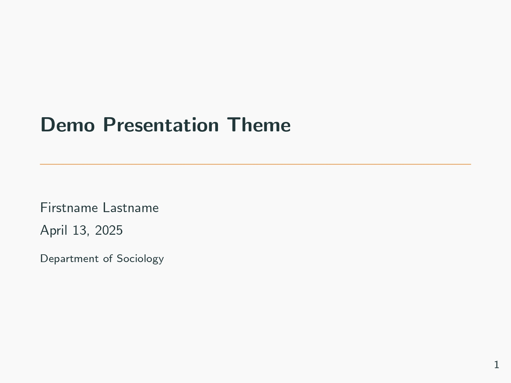
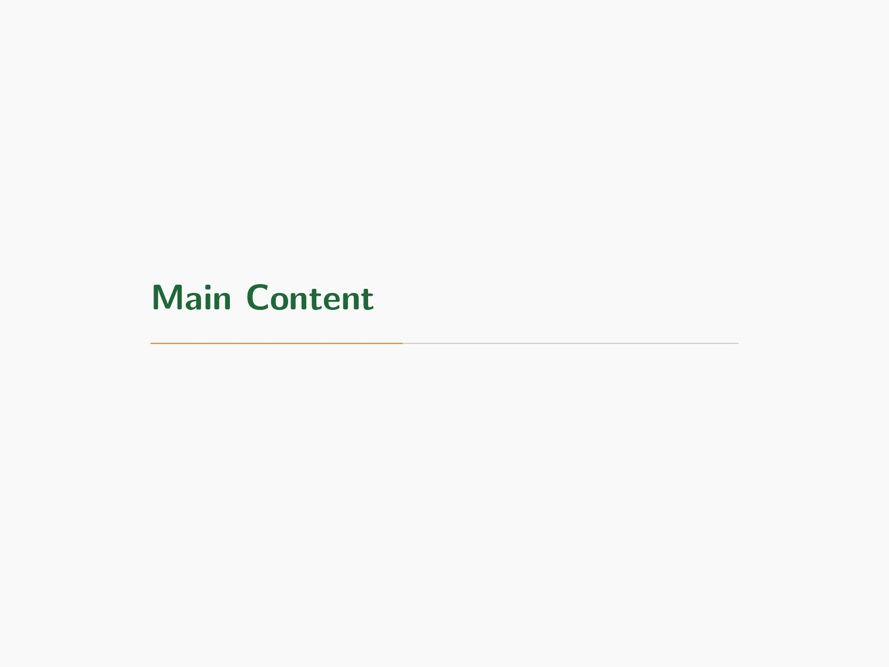
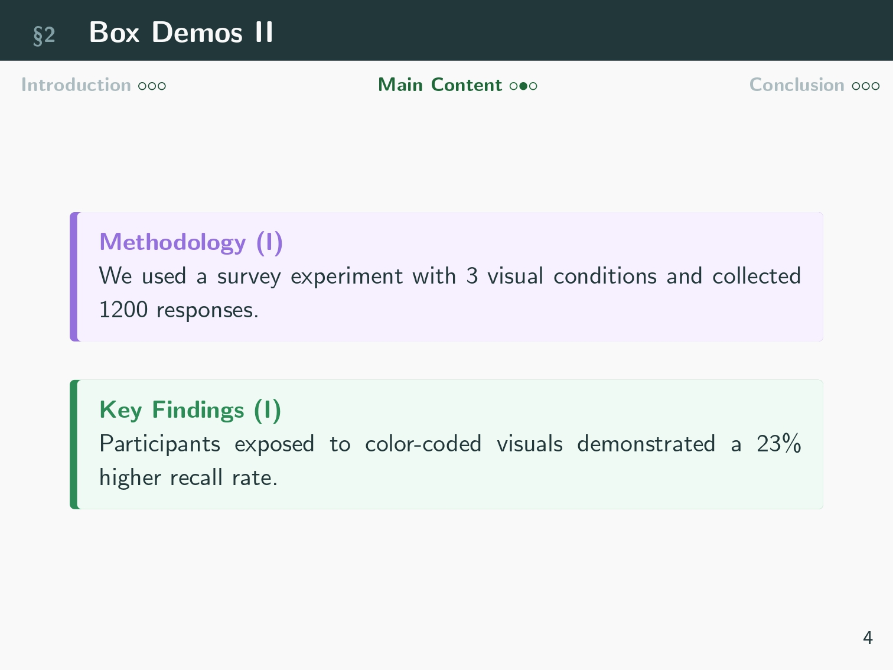
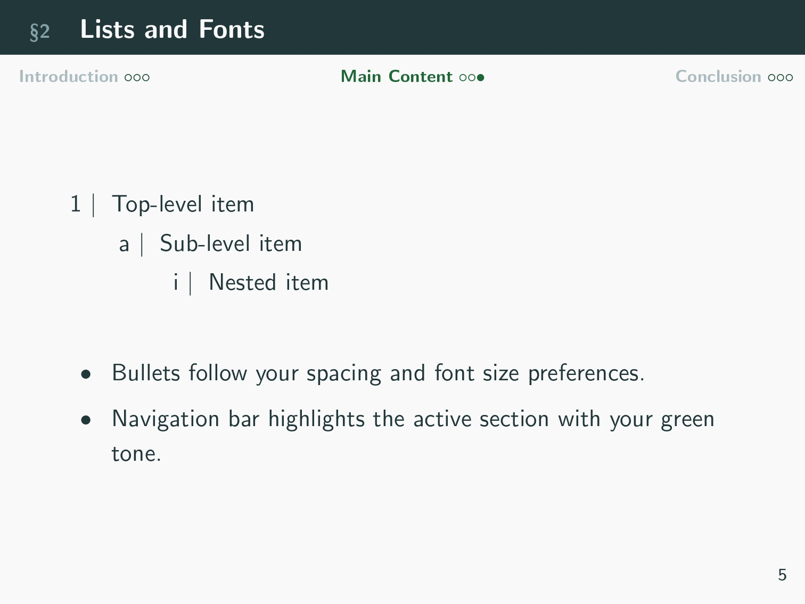
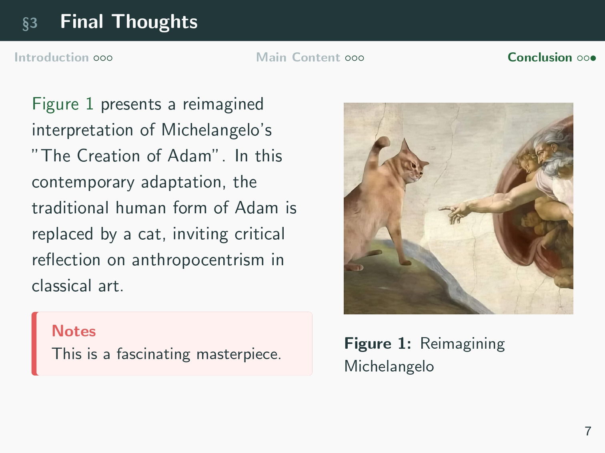

# 📊 `socsci-metro`: A Metropolis-Based Beamer Theme for Social Science Presentations

## 🔧 Built On

**`socsci-metro`** is a LaTeX Beamer theme built on top of [Metropolis](https://github.com/matze/mtheme) Beamer theme, tailored for social science and empirical research presentations, enhancing the clean visual style of `metropolis` with structure and function specific to research communication and presentations.

## ✨ Features

- 🧭 **Minimalist top navigation bar**  
  Clean, compact, and space-efficient — redesigned to avoid visual clutter while still indicating progress and section flow.
  
- 📌 **Research-focused content blocks**  
  Custom-colored `tcolorbox` environments for:
  - Research Questions
  - Hypotheses
  - Methodology
  - Key Findings
  - Notes / Instructor Commentary

- 🔠 **Improved typography & spacing**  
  Thoughtful control over list spacing, font sizing, and item markers to improve readability on-screen.

- 🧾 **Roman numeral continuation for multi-part frames**  
  Automatically numbered `(I)`, `(II)`, etc., for slides that extend a single topic.

## 📷 Previews

<p align="center">
  
  
  
  
  
</p>


## 🛠 Usage

```latex
\usepackage{socsci-metro}  % Make sure this .sty file is in the same folder or LaTeX path
```

Complete snippet for all 5 custom box types:

```latex
% Research Question box
\begin{rqbox}
To what extent does banana distribution predict umbrella ownership among penguins in urban jazz environments?
\end{rqbox}

% Hypothesis box
\begin{hypobox}
Penguins exposed to funkier rhythms are 42\% more likely to carry pastel-colored umbrellas during non-leap years.
\end{hypobox}

% Methodology box
\begin{methodbox}
We applied a recursive toast model using 17 types of marmalade as interaction controls within a Bayesian kazoo framework.
\end{methodbox}

% Key Findings box
\begin{findingsbox}
Orange marmalade had a statistically significant effect on kazoo enthusiasm (p < 0.0042), especially during Thursdays.
\end{findingsbox}

% Notes / Commentary box
\begin{notesbox}
Future research should investigate why hedgehogs remain unaffected by both toast density and jazz exposure.
\end{notesbox}

```

### 🔁 Resetting Box Counters

If you want to manually reset the numbering of any custom box type (e.g., when starting a new section or chapter), you can use `\setcounter{<boxcounter>}{<value>}`.

#### Available Counters

- `rqboxcounter` – for **Research Question** boxes  
- `hypoboxcounter` – for **Hypothesis** boxes  
- `methodboxcounter` – for **Methodology** boxes  
- `findingsboxcounter` – for **Key Findings** boxes  
- `notesboxcounter` – for **Notes / Commentary** boxes

#### Example

To reset the *Key Findings* box numbering back to 1:

```latex
\setcounter{findingsboxcounter}{1}
```

You can place this command anywhere in your document to start the numbering fresh.


## 📁 Repository Contents

- `socsci-metro.sty` — Theme style file  
- `preview/` — Example slide screenshots  
- `README.md` — You're reading it 😉
- `LICENSE` — MIT License


## 🧑‍🏫 Designed For

- Sociology, political science, public policy, communication studies
- Students, instructors, and researchers giving structured academic talks
- Presentations using methods from social statistics and empirical research

👋 Feel free to fork, customize, and share — or open an issue if you have suggestions  
(though full disclosure: I might be too lazy to actually implement them).


## 📜 License

MIT License. See `LICENSE` for details.

